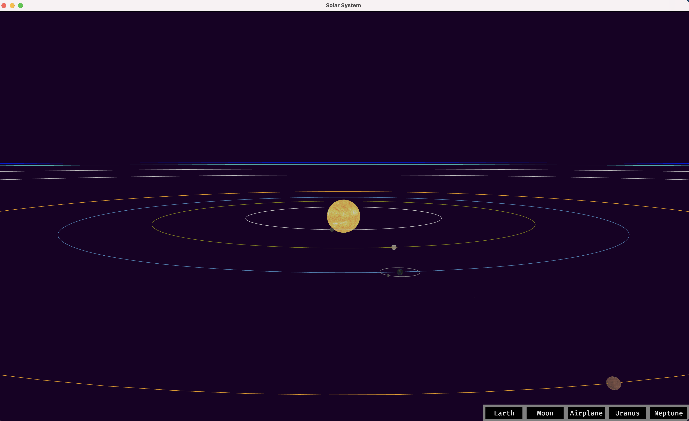

A simulated solar system,written in Rust using [bevy](https://bevyengine.org/)

WebAssembly online: [here](https://buggoing.github.io/solar_system/)

## Todo List
- [] making sun as a point light
- [] using real planet size, distance, obrit speed etc.